

# ✨ **hyprstellar** ✨
a cozy dotfiles for your cozy workflow

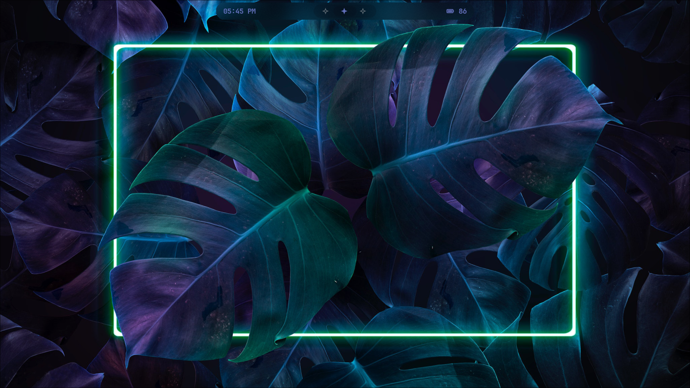

  
  
  

> [!WARNING]\
> Keep in mind that this is my daily driver.\
You might need to adjust some parts for your particular system, make sure to back up your configs first.

> Feel free to leave this repo a star ⭐.

- [Software Used](#software-used)
- [Screenshots](#screenshots)
- [Hotkeys](#hotkeys)
- [TODO](#todo)

## Software Used

### Base

| Type               | Name                                                |
| ------------------ | --------------------------------------------------- |
| OS                 | [Arch Linux](https://archlinux.org/)                |
| Window Compositor  | [Hyprland](https://hyprland.org/)                   |
| Bar                | [Waybar](https://github.com/Alexays/Waybar)         |
| Terminal           | [Kitty](https://github.com/kovidgoyal/kitty)        |
| Shell              | zsh                                                 |
| ZSH Prompt         | [Starship](https://github.com/starship/starship)    |

### Input & UI

| Type                   | Name                                                                                               |
| ---------------------- | -------------------------------------------------------------------------------------------------- |
| Main Font              | [Nothing Font](https://github.com/xeji01/nothingfont)                                              |
|                        | [Departure Mono](https://www.nerdfonts.com/font-downloads)                                         |
| Asian Font Collections | [Adobe Source Han Sans](https://archlinux.org/packages/extra/any/adobe-source-han-sans-otc-fonts/) |
| Emoji Font             | [Noto Emoji](https://github.com/googlefonts/noto-emoji)                                            |
| Emoji Selector         | [Rofi Emoji](https://github.com/Mange/rofi-emoji)                                                  | 
| Clipboard Manager      | [Cliphist](https://github.com/sentriz/cliphist)                                                    |
| Colorscheme            | [Pywal16](https://github.com/eylles/pywal16)                                                       |

### Utilities

| Type                               | Name                                                                             |
| ---------------------------------- | -------------------------------------------------------------------------------- |
| Text Editor                        | [Neovim](https://neovim.io/)                                                     |
| Terminal File Manager              | [LF File Manager](https://github.com/gokcehan/lf)                                |
| Wallpaper Backend                  | [SWWW](https://github.com/LGFae/swww)                                            |
| Better ls                          | [Lsd](https://github.com/lsd-rs/lsd)                                             |
| Better cd                          | [Zoxide](https://github.com/ajeetdsouza/zoxide)                                  |
| AUR Helper                         | [Paru](https://github.com/Morganamilo/paru)                                      |
| App Launcher                       | [Rofi](https://github.com/davatorium/rofi)                                       |
| System Info                        | [Fastfetch](https://github.com/fastfetch-cli/fastfetch)                          |
| Notification Daemon                | [Sway Notification Center](https://github.com/ErikReider/SwayNotificationCenter) |
| Lockscreen App                     | [Hyprlock](https://github.com/hyprwm/hyprlock)                                   |
| Idle Daemon                        | [Hypridle](https://github.com/hyprwm/hypridle)                                   |
| Power Menu App                     | [Wlogout](https://github.com/ArtsyMacaw/wlogout)                                 |
| WiFi Menu                          | [Wifi-Menu](https://github.com/podobu/wifimenu)                                  |
| Screenshot Utility                 | [Hyprshot](https://github.com/Gustash/Hyprshot)                                  |
| Screen Recorder                    | [WF-Recorder](https://github.com/ammen99/wf-recorder)                            |
| Blue Light Filter                  | [Hyprshade](https://github.com/loqusion/hyprshade)                               |

### Browser

| Type                  | Name                                                                                          |
| --------------------- | --------------------------------------------------------------------------------------------- |
| Browser               | [Librewolf](https://librewolf.net/)                                                           |
| Browser CSS           | [Fuji Fox](https://github.com/xeji01/fujifox) on my repo                                      |
| Librewolf Pywal Theme | [Pywalfox](https://addons.mozilla.org/ru/firefox/addon/pywalfox/)                             |
| Browser UI Font       | [Nothing Font](https://github.com/xeji01/nothingfont)                                         | 

### Multimedia

| Type                  | Name                                                            |
| --------------------- | --------------------------------------------------------------- |
| Video Player          | [MPV](https://mpv.io)                                           |
| Spotify               | [Spicetify Lucid](https://github.com/sanoojes/Spicetify-Lucid)  |

### Wallpapers

Check out my wallpapers [repository](https://github.com/xeji01/wallpaper)

## Screenshots

### Terminal

| Starship                                      |
| --------------------------------------------- |
| 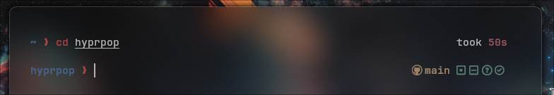                 |

| LF File Manager                               |
| --------------------------------------------- |
| 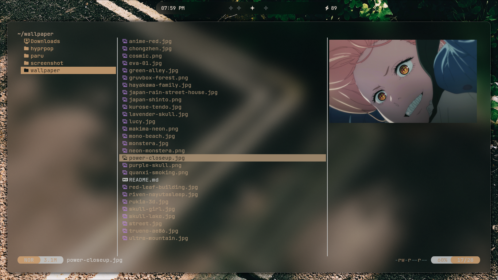                     |

| Fastfetch                                     |
| --------------------------------------------- |
| 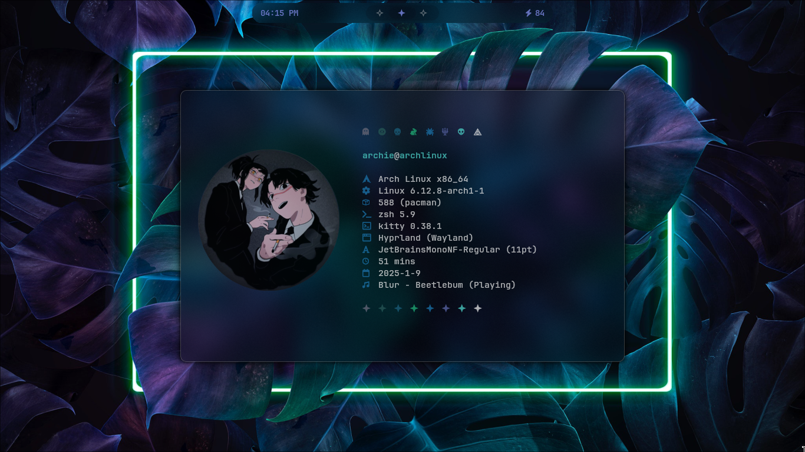               |

### Waybar

|                    |
| --------------------------------------------- |

| V1 & V2                                       |
| --------------------------------------------- |
|       |
| 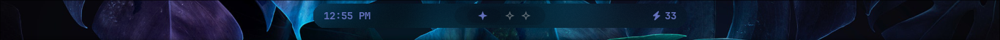  |
| 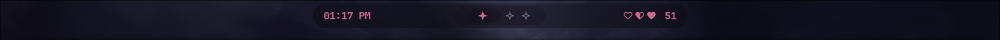       |
| 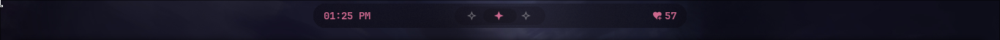   |

### Librewolf

  
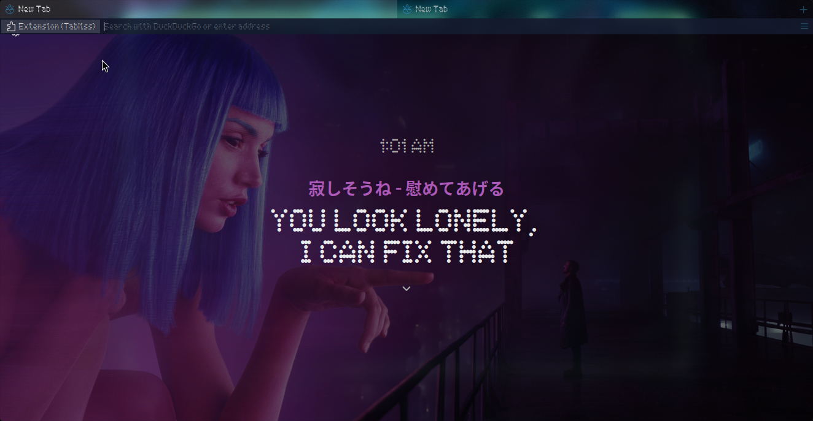
### Rofi

| Launcher                       | Emoji                           |
| ------------------------------ | ------------------------------- |
| 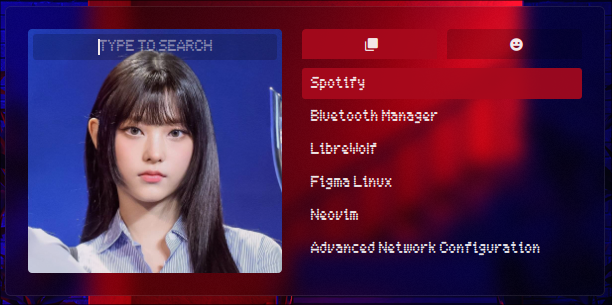 | 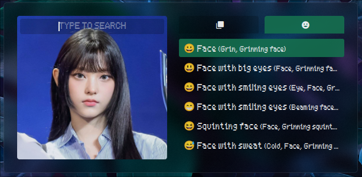 |

| Clipboard                                            |
| ---------------------------------------------------- |
| 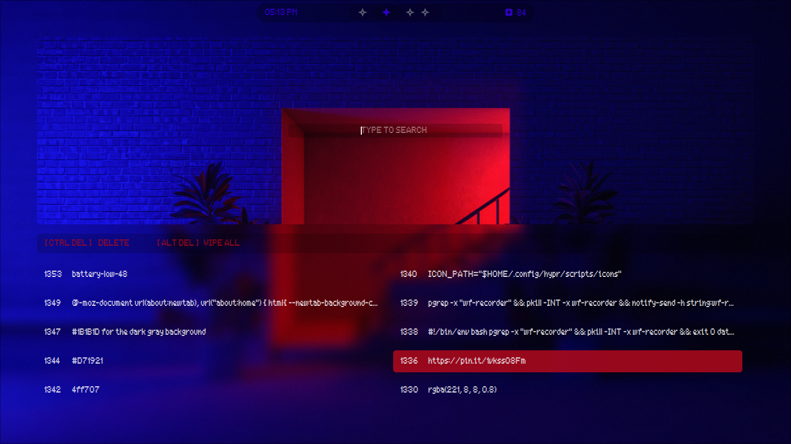                  |

### Wallpaper Selector

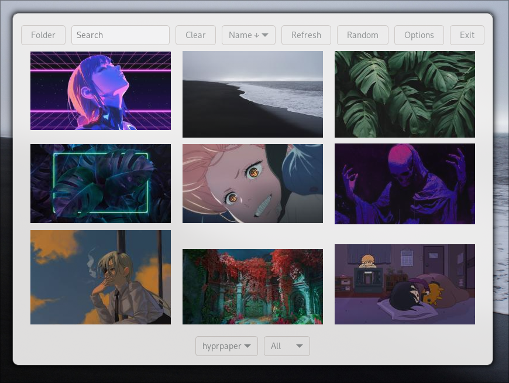

### Neovim

| Dashboard                                            | Telescope                                            | 
| ---------------------------------------------------- | ---------------------------------------------------- |
| 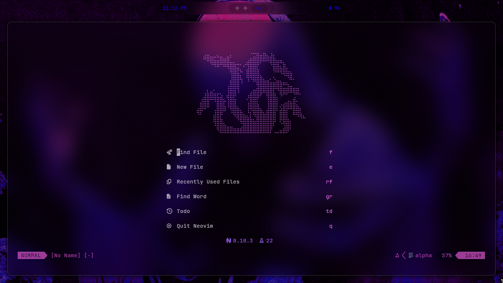                      | 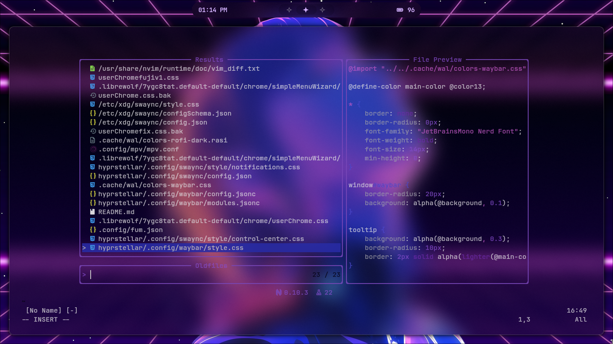                  |

### Wlogout

### Hyprlock

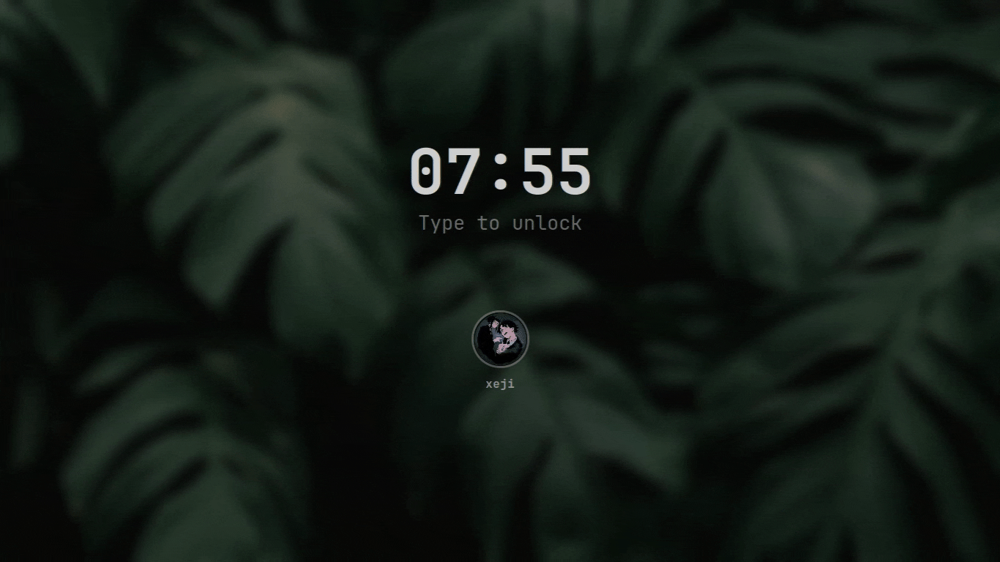

### Sway Notification Center

| Control Center                | Notification Pop-Up                                                             |
| ----------------------------- | ------------------------------------------------------------------------------- |
| 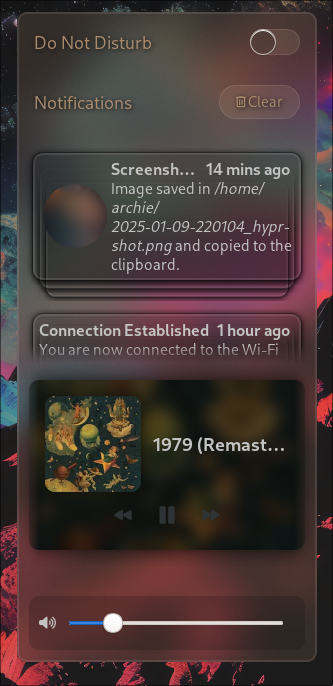   | 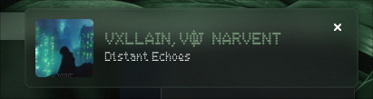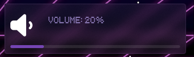 |

## Hotkeys

> [!NOTE]
> - `CapsLock` is used as `Esc`. You can change this behavior by removing `caps:escape` from the `~/.config/hypr/configs/input.conf`
> - On macOS, the `Super` key refers to the `Command` key.
> - On most other keyboards, `Super` refers to the `Windows` key.

| Key                                           | Command                              |
| --------------------------------------------- | ------------------------------------ |
| `Super` + `Enter`                             | Kitty                                |
| `Super` + `A`                                 | Select random wallpaper              |
| `Super` + `B`                                 | Librewolf                            |
| `Super` + `E`                                 | LF File Manager                      |
| `Super` + `L`                                 | Lockscreen                           |
| `Super` + `Q`                                 | Kill active window                   |
| `Super` + `R`                                 | Screen Recording                     |
| `Super` + `W`                                 | Wifi Menu via Rofi                   |
| `Super` + `Shift` + `Enter`                   | Floating Kitty                       |
| `Super` + `Shift` + `B`                       | Wallpaper Selector                   |
| `Super` + `Shift` + `C`                       | Center window                        |
| `Super` + `Shift` + `E`                       | Exit Hyprland                        |
| `Super` + `Shift` + `F`                       | Toggle fullscreen                    |
| `Super` + `Shift` + `L`                       | Power Menu                           |
| `Super` + `Shift` + `O`                       | Restart Waybar                       |
| `Super` + `Shift` + `R`                       | Restart Hyprland                     |
| `PrntScrn`                                    | Take screenshot of the entire screen |
| `Ctrl` + `PrntScrn`                           | Take screenshot of selected area     |
| `Ctrl` + `Shift` + `PrntScrn`                 | Take screenshot of selected window   | 
| `Ctrl` + `Super` + `Arrow down/up/left/right` | Resize window                        |

Other hotkeys can be found here `~/.config/hypr/configs/binds.conf`

## TODO
- [ ] bluetooth daemon
- [x] switch from yazi to lf
- [x] volume & brightness notification script
- [x] adding avatar to hyprlock
- [x] make a custom waybar
- [x] make a custom rofi
- [x] make a minimal Librewolf CSS

## Credits

